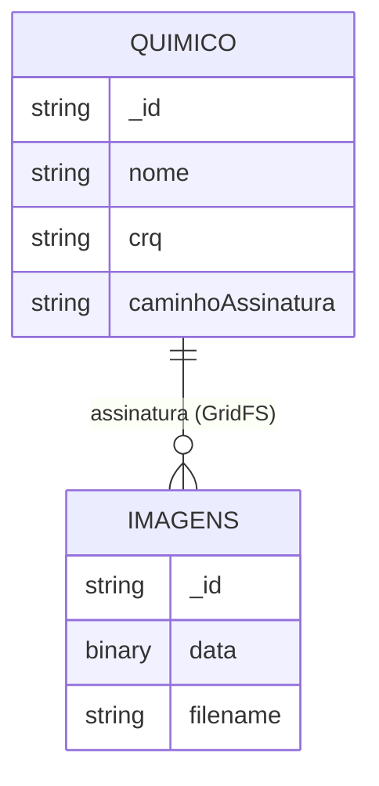

# 📝 Auto-Laudo

## Índice

- [Visão Geral](#visão-geral)
- [Funcionalidades](#funcionalidades)
- [Pré-requisitos](#pré-requisitos)
- [Como Usar](#como-usar)
  - [Subindo com Docker](#subindo-com-docker)
  - [Acessando a API](#acessando-a-api)
  - [Exemplos de Uso](#exemplos-de-uso)
- [Estrutura dos Containers](#estrutura-dos-containers)
- [Diagrama do Banco de Dados](#diagrama-do-banco-de-dados)
- [Observações](#observações)

---

## 📖 Visão Geral

O **Auto-Laudo** é uma solução moderna desenvolvida em Java com Quarkus para geração automática de laudos em PDF, como dedetização, desratização e limpeza de caixa d'água.  
A aplicação integra-se à [BrasilAPI](https://brasilapi.com.br/) para consulta de dados empresariais via CNPJ, utiliza MongoDB (com GridFS) para armazenamento seguro de assinaturas digitais e permite ao usuário definir a data de realização do serviço, calculando automaticamente a validade conforme normas da Anvisa.

> ⚠️ **IMPORTANTE:**  
> O sistema foi projetado para uso exclusivo de profissionais cadastrados como **Responsável Técnico (RT)** de suas respectivas empresas. O laudo gerado não possui validade jurídica fora deste contexto.

---

## 🚀 Funcionalidades

- 📄 **Geração de PDFs**: Criação de laudos personalizados com dados da empresa, serviço, assinatura digital e datas.
- 🔗 **Integração com BrasilAPI**: Consulta automática de dados cadastrais pelo CNPJ.
- ✍️ **Assinatura Digital**: Inserção da assinatura do responsável técnico, armazenada no MongoDB.
- 📅 **Datas Flexíveis**: O usuário escolhe a data de realização do serviço; a validade é calculada automaticamente conforme o tipo de laudo e normas da Anvisa.
- 🛠️ **API REST**: Endpoints para geração e download dos laudos.
- 🛡️ **Segurança**: Armazenamento seguro de assinaturas digitais via GridFS.

---

## 🛠️ Pré-requisitos

- [Docker](https://www.docker.com/) 🐳
- [Docker Compose](https://docs.docker.com/compose/) ⚙️
- (Opcional) [Java 21](https://adoptium.net/) ☕ e [Maven](https://maven.apache.org/) para execução local sem Docker

---

## 🚦 Como Usar

### Subindo com Docker

1. **Clone o repositório:**
   ```sh
   git clone https://github.com/seu-usuario/auto-laudo.git
   cd auto-laudo
   ```

2. **Configure o arquivo `.env` (opcional):**
   Crie um arquivo `.env` na raiz com a variável de conexão do MongoDB:
   ```
   MONGO_URL=mongodb://mongo:27017
   ```

3. **Build e subida dos containers:**
   ```sh
   docker compose up -d --build
   ```
   Isso irá:
   - Buildar a aplicação Quarkus (Java 21)
   - Subir o MongoDB
   - Disponibilizar a aplicação na porta 8080

---

### Acessando a API

- **Swagger UI (local):** [http://localhost:8080/api](http://localhost:8080/api)
- **OpenAPI (local):** [http://localhost:8080/openapi](http://localhost:8080/openapi)
- **Swagger UI (produção):** [https://auto-laudo-production.up.railway.app/api/](https://auto-laudo-production.up.railway.app/api/)

---

### Exemplos de Uso

#### 🐜 Gerar laudo de dedetização

```http
POST /laudo/gerar/dedetizacao
Content-Type: application/json

{
  "cnpj": "12345678000199",
  "crq": "12345",
  "dataServico": "01092025" // formato ddMMyyyy
}
```
O PDF será baixado como resposta.

#### 💧 Gerar laudo de limpeza de caixa d'água

```http
POST /laudo/gerar/limpezaCaixaDagua
Content-Type: application/json

{
  "cnpj": "12345678000199",
  "crq": "12345",
  "dataServico": "01092025"
}
```

---

## 🗂️ Estrutura dos Containers

| Container         | Descrição                        | Porta   |
|-------------------|----------------------------------|---------|
| `auto-laudo-app`  | Aplicação Quarkus (Java 21)      | 8080    |
| `mongo`           | Banco de dados MongoDB            | 27017   |

---

## 🗃️ Diagrama do Banco de Dados



- **Coleção `quimico`**: Dados do responsável técnico (nome, CRQ, referência para assinatura).
- **Bucket GridFS `imagens`**: Armazena arquivos binários (assinaturas digitais).
- O campo `caminhoAssinatura` do químico referencia o `_id` do arquivo no GridFS.

---

## 📌 Observações

- O MongoDB é utilizado tanto para dados (`quimico`) quanto para arquivos (assinaturas digitais via GridFS).
- Os templates de PDF devem estar em `src/main/resources`.
- O sistema está pronto para ser expandido para outros tipos de laudo.
